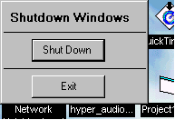



## Shut down Windows NO\! API in just 1 line of code

### Description

this simpel program will shut down windows WITHOUT the use of any API

in just 1 line of code....please vote for my code

thanks

-jason
 
### More Info
 

             |
---                |---
**Submitted On**   |2000-09-10 16:28:26
**By**             |[Deep Freeze](https://github.com/Planet-Source-Code/PSCIndex/blob/master/ByAuthor/deep-freeze.md)
**Level**          |Intermediate
**User Rating**    |3.4 (27 globes from 8 users)
**Compatibility**  |VB 5\.0, VB 6\.0
**Category**       |[Miscellaneous](https://github.com/Planet-Source-Code/PSCIndex/blob/master/ByCategory/miscellaneous__1-1.md)
**World**          |[Visual Basic](https://github.com/Planet-Source-Code/PSCIndex/blob/master/ByWorld/visual-basic.md)
**Archive File**   |[CODE\_UPLOAD98099102000\.zip](https://github.com/Planet-Source-Code/deep-freeze-shut-down-windows-no-api-in-just-1-line-of-code__1-11401/archive/master.zip)

